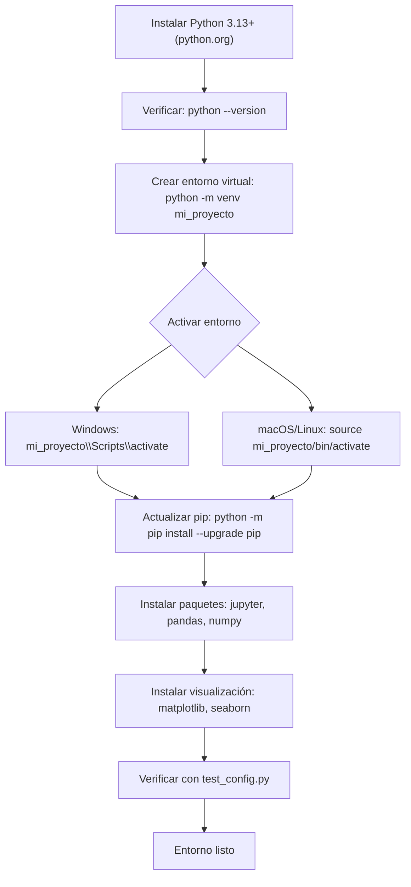

## Capítulo 1 - Introducción a Python

### ¿Qué es Python?
Python es un lenguaje de programación de alto nivel, interpretado y de propósito general que enfatiza la legibilidad del código. Su sintaxis permite a los programadores expresar conceptos en menos líneas de código en comparación con otros lenguajes como C++ o Java.

### Características Principales

- **Legibilidad**: Python tiene una sintaxis clara y sencilla que hace que el código sea fácil de leer y entender, lo que reduce el costo de mantenimiento.

- **Versatilidad**: Es utilizado en una amplia variedad de aplicaciones, desde desarrollo web y análisis de datos hasta inteligencia artificial y automatización de tareas.

- **Amplia Biblioteca Estándar**: Python viene con una extensa colección de módulos y paquetes que permiten a los desarrolladores realizar diversas tareas sin necesidad de escribir código desde cero.

- **Interpretado Dinámico**: Python ejecuta el código línea por línea, lo que facilita la depuración y permite un desarrollo más rápido. Además, su tipado dinámico permite mayor flexibilidad en la programación.

- **Comunidad y Soporte**: Python cuenta con una gran comunidad de desarrolladores que contribuyen a su crecimiento y mejora continua. Hay abundante documentación y recursos disponibles para aprender y resolver problemas.

# 01 - Fundamentos modernos para el analisis de datos con python

## Clase 1 - Configuracion Profesional del Entorno y Primer Proyecto

### 1. Configuracion del Entorno de Desarrollo Profesional

#### 1.1 Instalación de Python
- **Descargar Python**: Visitar [python.org](https://python.org) y descargar la versión más reciente (3.13+)
- **Instalación**: Ejecutar el instalador marcando "Add Python to PATH"
- **Verificar**: Abrir terminal y ejecutar `python --version`

#### 1.2 Gráfico de Configuración del Entorno




#### 1.3 Configuración del Entorno Virtual
```bash
# Crear entorno virtual
python -m venv mi_proyecto

# Activar entorno virtual
# Windows:
mi_proyecto\Scripts\activate
# macOS/Linux:
source mi_proyecto/bin/activate

# Desactivar
deactivate
```

#### 1.4 Gestión de Paquetes
```bash
# Actualizar pip
python -m pip install --upgrade pip

# Instalar paquetes
pip install nombre_paquete

# Instalar desde requirements.txt
pip install -r requirements.txt

# Generar requirements.txt
pip freeze > requirements.txt
```

#### 1.5 Herramientas Esenciales
```bash
# Jupyter Notebook (para análisis de datos)
pip install jupyter

# Pandas (manipulación de datos)
pip install pandas

# NumPy (computación numérica)
pip install numpy

# Matplotlib (visualización)
pip install matplotlib

# Seaborn (visualización estadística)
pip install seaborn
```

#### 1.6 Configuración del IDE
- **VS Code**: Instalar extensión "Python" de Microsoft
- **PyCharm**: Configurar intérprete Python del entorno virtual
- **Spyder**: Incluido con Anaconda

#### 1.7 Alternativas de Trabajo en Python

##### **🌐 Opción A: Google Colab (Recomendado para Principiantes)**
**Ventajas**: 
- ✅ No requiere instalación local
- ✅ Acceso gratuito a GPUs/TPUs
- ✅ Colaboración en tiempo real
- ✅ Integración con Google Drive

**Configuración Paso a Paso:**
```
1. 🌐 Abrir navegador → colab.research.google.com
2. 📱 Iniciar sesión con cuenta Google
3. ➕ Crear nuevo notebook
4. 🐍 Seleccionar runtime: Python 3
5. 📊 Instalar paquetes adicionales:
   !pip install pandas numpy matplotlib seaborn
6. 💾 Guardar en Google Drive
```

**Uso Básico:**
```python
# Primera celda - Instalar paquetes
!pip install pandas numpy matplotlib seaborn

# Segunda celda - Importar y usar
import pandas as pd
import numpy as np
import matplotlib.pyplot as plt

print("¡Colab funcionando!")
```

##### **📦 Opción B: Anaconda + Jupyter Notebook (Instalación Local)**
**Ventajas**: 
- ✅ Entorno completo y profesional
- ✅ Funciona offline
- ✅ Múltiples herramientas integradas
- ✅ Gestión de paquetes simplificada

**Configuración Paso a Paso:**
```
1. 📥 Descargar Anaconda: anaconda.com/download
2. 🚀 Instalar Anaconda (marcar "Add to PATH")
3. 🔍 Abrir Anaconda Navigator
4. 📓 Lanzar Jupyter Notebook
5. 🌐 Se abre en navegador automáticamente
6. 📁 Navegar a tu carpeta de proyecto
7. ➕ Crear nuevo notebook Python 3
```

**Verificación de Instalación:**
```python
# En Jupyter Notebook
import sys
print(f"Python: {sys.version}")

import pandas as pd
print(f"Pandas: {pd.__version__}")

import numpy as np
print(f"NumPy: {np.__version__}")

print("✅ Anaconda + Jupyter funcionando!")
```

##### **⚡ Opción C: VS Code + Jupyter Extension (Híbrido)**
**Ventajas**: 
- ✅ IDE profesional con notebooks integrados
- ✅ Control de versiones integrado
- ✅ IntelliSense y debugging
- ✅ Múltiples lenguajes en un lugar

**Configuración Paso a Paso:**
```
1. 📥 Instalar VS Code: code.visualstudio.com
2. 🔌 Instalar extensión "Python" de Microsoft
3. 🔌 Instalar extensión "Jupyter" de Microsoft
4. 🐍 Configurar intérprete Python
5. 📓 Crear archivo .ipynb
6. 🚀 Ejecutar celdas con Shift+Enter
```

**Uso en VS Code:**
```python
# Celda 1: Configuración
import pandas as pd
import numpy as np

# Celda 2: Datos de ejemplo
datos = pd.DataFrame({
    'A': [1, 2, 3, 4, 5],
    'B': ['a', 'b', 'c', 'd', 'e']
})

# Celda 3: Visualización
datos.plot(kind='bar')
plt.show()
```

##### **📊 Comparación de Opciones**

| Característica | Google Colab | Anaconda | VS Code |
|----------------|--------------|----------|---------|
| **Instalación** | ⚡ Instantánea | 🐌 Completa | 🚀 Rápida |
| **Recursos** | ☁️ Cloud (GPU) | 💻 Local | 💻 Local |
| **Offline** | ❌ No | ✅ Sí | ✅ Sí |
| **Colaboración** | ✅ Excelente | ⚠️ Limitada | ⚠️ Limitada |
| **Profesional** | ⚠️ Básico | ✅ Completo | ✅ Avanzado |
| **Principiantes** | ✅ Ideal | ⚠️ Intermedio | ⚠️ Avanzado |

##### **🎯 Recomendación por Perfil**

- **👶 Principiantes**: **Google Colab** - Sin instalación, fácil de usar
- **👨‍🎓 Estudiantes**: **Anaconda** - Entorno completo, bueno para proyectos
- **👨‍💻 Desarrolladores**: **VS Code** - Control total, profesional
- **🔬 Investigadores**: **Anaconda** - Herramientas científicas integradas

#### 1.8 Estructura de Proyecto Recomendada
```
mi_proyecto/
├── src/
│   ├── __init__.py
│   └── main.py
├── data/
├── notebooks/
├── tests/
├── requirements.txt
├── README.md
└── .gitignore
```

#### 1.9 Comandos Útiles
```bash
# Ejecutar script Python
python script.py

# Ejecutar con argumentos
python script.py arg1 arg2

# Modo interactivo
python

# Ejecutar tests
python -m pytest

# Linting y formateo
pip install flake8 black
flake8 src/
black src/
```

#### 1.9 Configuración de Git (Opcional)
```bash
# Inicializar repositorio
git init

# Crear .gitignore
echo "venv/" > .gitignore
echo "__pycache__/" >> .gitignore
echo "*.pyc" >> .gitignore
echo ".ipynb_checkpoints/" >> .gitignore
```

### 2. Verificación de la Configuración
```python
# Crear archivo test_config.py
import sys
import pandas as pd
import numpy as np
import matplotlib.pyplot as plt

print(f"Python version: {sys.version}")
print(f"Pandas version: {pd.__version__}")
print(f"NumPy version: {np.__version__}")
print("¡Configuración exitosa!")
```

### 3. Próximos Pasos
- Crear primer proyecto con Jupyter Notebook
- Explorar funcionalidades básicas de Pandas
- Practicar con datasets de ejemplo
