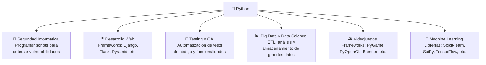
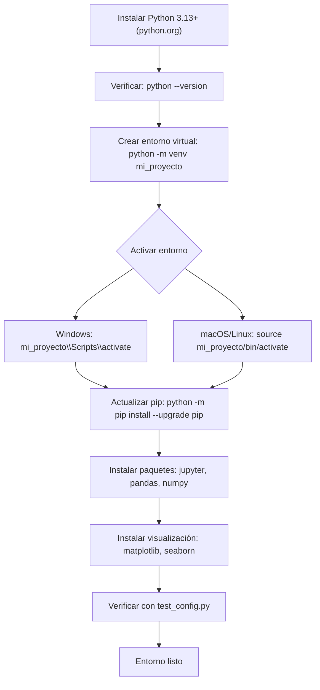
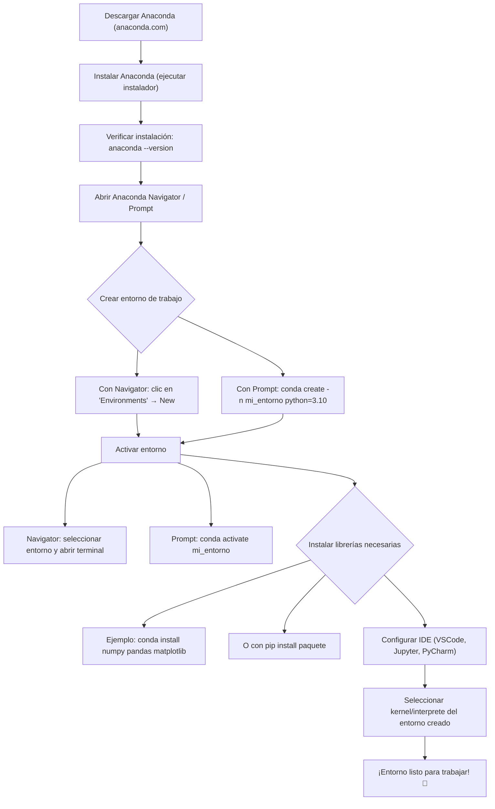

## Capítulo 1 - Introducción a Python

## ¿Qué es Python?

Python es un lenguaje de programación de alto nivel, interpretado y de propósito general que enfatiza la legibilidad del código. Su sintaxis permite a los programadores expresar conceptos en menos líneas de código en comparación con otros lenguajes como C++ o Java.



### Características Principales de Python

- **Legibilidad**: Python tiene una sintaxis clara y sencilla que hace que el código sea fácil de leer y entender, lo que reduce el costo de mantenimiento.

- **Versatilidad**: Es utilizado en una amplia variedad de aplicaciones, desde desarrollo web y análisis de datos hasta inteligencia artificial y automatización de tareas.

- **Amplia Biblioteca Estándar**: Python viene con una extensa colección de módulos y paquetes que permiten a los desarrolladores realizar diversas tareas sin necesidad de escribir código desde cero.

- **Interpretado Dinámico**: Python ejecuta el código línea por línea, lo que facilita la depuración y permite un desarrollo más rápido. Además, su tipado dinámico permite mayor flexibilidad en la programación.

#### Ejemplo de Tipado Dinámico

En Python, no necesitas declarar el tipo de una variable al asignarle un valor. Esto se conoce como tipado dinámico. Aquí tienes un ejemplo:

```python
# Asignación de un entero
a = 5
print(type(a))  # <class 'int'>

# Reasignación a una cadena
a = 'Hola'
print(type(a))  # <class 'str'>
```

En este ejemplo, la variable `a` cambia de un entero a una cadena sin necesidad de declarar su tipo, demostrando la flexibilidad del tipado dinámico en Python.

### Características Principales

- **Legibilidad**: Python tiene una sintaxis clara y sencilla que hace que el código sea fácil de leer y entender, lo que reduce el costo de mantenimiento.

- **Versatilidad**: Es utilizado en una amplia variedad de aplicaciones, desde desarrollo web y análisis de datos hasta inteligencia artificial y automatización de tareas.

- **Amplia Biblioteca Estándar**: Python viene con una extensa colección de módulos y paquetes que permiten a los desarrolladores realizar diversas tareas sin necesidad de escribir código desde cero.

- **Interpretado Dinámico**: Python ejecuta el código línea por línea, lo que facilita la depuración y permite un desarrollo más rápido. Además, su tipado dinámico permite mayor flexibilidad en la programación.

- **Comunidad y Soporte**: Python cuenta con una gran comunidad de desarrolladores que contribuyen a su crecimiento y mejora continua. Hay abundante documentación y recursos disponibles para aprender y resolver problemas.

# 01 - Fundamentos modernos para el analisis de datos con python

## Clase 1 - Configuracion Profesional del Entorno y Primer Proyecto

### 1. Configuracion del Entorno de Desarrollo Profesional

#### 1.1 Instalación de Python
- **Descargar Python**: Visitar [python.org](https://python.org) y descargar la versión más reciente (3.13+)
- **Instalación**: Ejecutar el instalador marcando "Add Python to PATH"
- **Verificar**: Abrir terminal y ejecutar `python --version`

#### 1.2 Gráfico de Configuración del Entorno




#### 1.3 Configuración del Entorno Virtual
```bash
# Crear entorno virtual
python -m venv mi_proyecto

# Activar entorno virtual
# Windows:
mi_proyecto\Scripts\activate
# macOS/Linux:
source mi_proyecto/bin/activate

# Desactivar
deactivate
```

#### 1.4 Gestión de Paquetes
```bash
# Actualizar pip
python -m pip install --upgrade pip

# Instalar paquetes
pip install nombre_paquete

# Instalar desde requirements.txt
pip install -r requirements.txt

# Generar requirements.txt
pip freeze > requirements.txt
```

#### 1.5 Herramientas Esenciales
```bash
# Jupyter Notebook (para análisis de datos)
pip install jupyter

# Pandas (manipulación de datos)
pip install pandas

# NumPy (computación numérica)
pip install numpy

# Matplotlib (visualización)
pip install matplotlib

# Seaborn (visualización estadística)
pip install seaborn
```

#### 1.6 Configuración del IDE
- **VS Code**: Instalar extensión "Python" de Microsoft
- **PyCharm**: Configurar intérprete Python del entorno virtual
- **Spyder**: Incluido con Anaconda

#### 1.7 Alternativas de Trabajo en Python

##### **🌐 Opción A: Google Colab (Recomendado para Principiantes)**
**Ventajas**: 
- ✅ No requiere instalación local
- ✅ Acceso gratuito a GPUs/TPUs
- ✅ Colaboración en tiempo real
- ✅ Integración con Google Drive

**Configuración Paso a Paso:**
```
1. 🌐 Abrir navegador → colab.research.google.com
2. 📱 Iniciar sesión con cuenta Google
3. ➕ Crear nuevo notebook
4. 🐍 Seleccionar runtime: Python 3
5. 📊 Instalar paquetes adicionales:
   !pip install pandas numpy matplotlib seaborn
6. 💾 Guardar en Google Drive
```

**Uso Básico:**
```python
# Primera celda - Instalar paquetes
!pip install pandas numpy matplotlib seaborn

# Segunda celda - Importar y usar
import pandas as pd
import numpy as np
import matplotlib.pyplot as plt

print("¡Colab funcionando!")
```

##### **📦 Opción B: Anaconda + Jupyter Notebook (Instalación Local)**
**Ventajas**: 
- ✅ Entorno completo y profesional
- ✅ Funciona offline
- ✅ Múltiples herramientas integradas
- ✅ Gestión de paquetes simplificada

**Configuración Paso a Paso:**
```
1. 📥 Descargar Anaconda: anaconda.com/download
2. 🚀 Instalar Anaconda (marcar "Add to PATH")
3. 🔍 Abrir Anaconda Navigator
4. 📓 Lanzar Jupyter Notebook
5. 🌐 Se abre en navegador automáticamente
6. 📁 Navegar a tu carpeta de proyecto
7. ➕ Crear nuevo notebook Python 3
```

**Verificación de Instalación:**
```python
# En Jupyter Notebook
import sys
print(f"Python: {sys.version}")

import pandas as pd
print(f"Pandas: {pd.__version__}")

import numpy as np
print(f"NumPy: {np.__version__}")

print("✅ Anaconda + Jupyter funcionando!")
```

##### **⚡ Opción C: VS Code + Jupyter Extension (Híbrido)**
**Ventajas**: 
- ✅ IDE profesional con notebooks integrados
- ✅ Control de versiones integrado
- ✅ IntelliSense y debugging
- ✅ Múltiples lenguajes en un lugar

**Configuración Paso a Paso:**
```
1. 📥 Instalar VS Code: code.visualstudio.com
2. 🔌 Instalar extensión "Python" de Microsoft
3. 🔌 Instalar extensión "Jupyter" de Microsoft
4. 🐍 Configurar intérprete Python
5. 📓 Crear archivo .ipynb
6. 🚀 Ejecutar celdas con Shift+Enter
```

**Uso en VS Code:**
```python
# Celda 1: Configuración
import pandas as pd
import numpy as np

# Celda 2: Datos de ejemplo
datos = pd.DataFrame({
    'A': [1, 2, 3, 4, 5],
    'B': ['a', 'b', 'c', 'd', 'e']
})

# Celda 3: Visualización
datos.plot(kind='bar')
plt.show()
```

##### **📊 Comparación de Opciones**

| Característica | Google Colab | Anaconda | VS Code |
|----------------|--------------|----------|---------|
| **Instalación** | ⚡ Instantánea | 🐌 Completa | 🚀 Rápida |
| **Recursos** | ☁️ Cloud (GPU) | 💻 Local | 💻 Local |
| **Offline** | ❌ No | ✅ Sí | ✅ Sí |
| **Colaboración** | ✅ Excelente | ⚠️ Limitada | ⚠️ Limitada |
| **Profesional** | ⚠️ Básico | ✅ Completo | ✅ Avanzado |
| **Principiantes** | ✅ Ideal | ⚠️ Intermedio | ⚠️ Avanzado |

##### **🎯 Recomendación por Perfil**

- **👶 Principiantes**: **Google Colab** - Sin instalación, fácil de usar
- **👨‍🎓 Estudiantes**: **Anaconda** - Entorno completo, bueno para proyectos
- **👨‍💻 Desarrolladores**: **VS Code** - Control total, profesional
- **🔬 Investigadores**: **Anaconda** - Herramientas científicas integradas

#### 1.8 Estructura de Proyecto Recomendada
```
mi_proyecto/
├── src/
│   ├── __init__.py
│   └── main.py
├── data/
├── notebooks/
├── tests/
├── requirements.txt
├── README.md
└── .gitignore
```

#### 1.9 Comandos Útiles
```bash
# Ejecutar script Python
python script.py

# Ejecutar con argumentos
python script.py arg1 arg2

# Modo interactivo
python

# Ejecutar tests
python -m pytest

# Linting y formateo
pip install flake8 black
flake8 src/
black src/
```

#### 1.9 Configuración de Git (Opcional)
```bash
# Inicializar repositorio
git init

# Crear .gitignore
echo "venv/" > .gitignore
echo "__pycache__/" >> .gitignore
echo "*.pyc" >> .gitignore
echo ".ipynb_checkpoints/" >> .gitignore
```

### Ventajas de Usar Anaconda para Análisis de Datos

Anaconda es una distribución de Python que simplifica la gestión de entornos virtuales y la instalación de bibliotecas para análisis de datos. Aquí te explicamos por qué es una opción popular:

- **Bibliotecas Preinstaladas**: Anaconda viene con muchas bibliotecas populares para análisis de datos ya instaladas, lo que te ahorra tiempo y esfuerzo. Algunas de estas bibliotecas incluyen:
  - **Pandas**: Para manipulación y análisis de datos.
  - **NumPy**: Para computación numérica y manejo de matrices.
  - **Matplotlib**: Para crear visualizaciones estáticas y dinámicas.
  - **Seaborn**: Para visualización estadística basada en Matplotlib.
  - **SciPy**: Para tareas matemáticas avanzadas como optimización e integración.
  - **Scikit-learn**: Para aprendizaje automático y modelado predictivo.

- **Gestión de Entornos**: Anaconda facilita la creación y gestión de entornos virtuales, permitiéndote aislar proyectos y sus dependencias.

#### Comandos Básicos de Anaconda

- **Crear un nuevo entorno**:
  ```bash
  conda create --name mi_entorno
  ```

- **Activar un entorno**:
  ```bash
  conda activate mi_entorno
  ```

- **Listar entornos**:
  ```bash
  conda env list
  ```

- **Instalar paquetes adicionales**:
  ```bash
  conda install nombre_paquete
  ```

Usar Anaconda puede simplificar mucho tu flujo de trabajo, especialmente si trabajas con proyectos de ciencia de datos o análisis. Además, su interfaz gráfica, Anaconda Navigator, ofrece una manera fácil de gestionar entornos y paquetes sin necesidad de usar la línea de comandos.

#### Instalación Manual de Bibliotecas con pip

Si no estás usando Anaconda, puedes instalar las bibliotecas de análisis de datos manualmente con pip. Aquí tienes los comandos:

```bash
pip install pandas numpy matplotlib seaborn scipy scikit-learn statsmodels
```

Estos comandos instalarán las bibliotecas necesarias para realizar análisis de datos y visualización en Python.


### 2. Verificación de la Configuración
```python
# Crear archivo test_config.py
import sys
import pandas as pd
import numpy as np
import matplotlib.pyplot as plt

print(f"Python version: {sys.version}")
print(f"Pandas version: {pd.__version__}")
print(f"NumPy version: {np.__version__}")
print("¡Configuración exitosa!")
```

### 3. Próximos Pasos
- Crear primer proyecto con Jupyter Notebook
- Explorar funcionalidades básicas de Pandas
- Practicar con datasets de ejemplo

### Creación de Cuenta y Gestión de Repositorios en GitHub

GitHub es una plataforma popular para el control de versiones y la colaboración en proyectos de software. Aquí te explicamos cómo comenzar:

#### Crear una Cuenta en GitHub

1. Visita [github.com](https://github.com) y haz clic en "Sign up".
2. Completa el formulario de registro con tu correo electrónico, nombre de usuario y contraseña.
3. Verifica tu correo electrónico para activar la cuenta.

#### Comandos Esenciales de Git

- **Inicializar un repositorio local**:
  ```bash
  git init
  ```

- **Agregar archivos al área de preparación**:
  ```bash
  git add .
  ```

- **Confirmar cambios**:
  ```bash
  git commit -m "Mensaje del commit"
  ```

- **Conectar a un repositorio remoto**:
  ```bash
  git remote add origin <URL-del-repositorio>
  ```

- **Subir cambios al repositorio remoto**:
  ```bash
  git push origin main
  ```

#### Crear un Repositorio en GitHub

1. Inicia sesión en tu cuenta de GitHub.
2. Haz clic en el botón "+" en la esquina superior derecha y selecciona "New repository".
3. Completa el nombre del repositorio y la descripción.
4. Decide si el repositorio será público o privado.
5. Haz clic en "Create repository".

Con estos pasos, puedes gestionar tus proyectos de manera eficiente y colaborar con otros desarrolladores en GitHub.

### Instalación de Cursor y Extensiones para un Espacio de Trabajo Óptimo

Para mejorar tu experiencia de desarrollo, considera instalar Cursor y algunas extensiones útiles:

#### Instalación de Cursor

1. Visita el sitio oficial de Cursor y descarga el instalador adecuado para tu sistema operativo.
2. Sigue las instrucciones del instalador para completar la instalación.

#### Extensiones Recomendadas

- **Python**: Proporciona soporte para el desarrollo en Python, incluyendo IntelliSense y debugging.
- **Jupyter**: Permite trabajar con notebooks de Jupyter directamente en tu editor.
- **GitLens**: Mejora la integración de Git mostrando información detallada sobre el historial de cambios.
- **Prettier**: Formatea tu código automáticamente para mantener un estilo consistente.

#### Temas Recomendados

- **Dracula Official**: Un tema oscuro que es fácil para la vista.
- **One Dark Pro**: Inspirado en el tema de Atom, ofrece un diseño limpio y moderno.
- **Genius Dark Theme**: Un tema oscuro cuidadosamente diseñado para una experiencia de codificación óptima. [Instalar desde Visual Studio Marketplace](https://marketplace.visualstudio.com/items?itemName=jefersonqui-dev.genius)

Estas herramientas y configuraciones te ayudarán a crear un entorno de desarrollo más productivo y agradable.

### Comparación con Java y C++

Python se diferencia de lenguajes como Java y C++ en varios aspectos clave, especialmente en su tipado dinámico y sintaxis.

#### Tipado Dinámico vs. Tipado Estático

- **Python (Tipado Dinámico)**:
  - No requiere declarar el tipo de una variable al asignarla.
  - Permite cambiar el tipo de una variable en tiempo de ejecución.
  
  ```python
  a = 10  # Entero
  a = 'Texto'  # Ahora es una cadena
  ```

- **Java y C++ (Tipado Estático)**:
  - Requieren declarar el tipo de una variable al definirla.
  - El tipo de una variable no puede cambiar una vez definido.
  
  ```java
  // Java
  int a = 10;
  // a = "Texto";  // Error: incompatible types
  
  // C++
  int a = 10;
  // a = "Texto";  // Error: cannot convert
  ```

#### Sintaxis

- **Python**:
  - Sintaxis concisa y legible.
  - Usa indentación para definir bloques de código.
  
  ```python
  def suma(a, b):
      return a + b
  ```

- **Java**:
  - Sintaxis más verbosa.
  - Usa llaves `{}` para definir bloques de código.
  
  ```java
  public int suma(int a, int b) {
      return a + b;
  }
  ```

- **C++**:
  - Similar a Java en términos de verbosidad y uso de llaves.
  
  ```cpp
  int suma(int a, int b) {
      return a + b;
  }
  ```

Estas diferencias hacen que Python sea más flexible y fácil de leer, especialmente para principiantes, mientras que Java y C++ ofrecen un control más estricto sobre los tipos de datos y la estructura del código.

### Creación de un Proyecto de Análisis de Datos en Python

Para trabajar de manera profesional en análisis de datos con Python, es importante tener una estructura de proyecto bien organizada. Aquí te presentamos una estructura básica que puedes seguir:

#### Estructura de Carpetas Recomendada

```
mi_proyecto/
├── data/               # Datos brutos y procesados
├── notebooks/          # Jupyter notebooks
├── src/                # Código fuente del proyecto
│   ├── __init__.py
│   └── main.py
├── tests/              # Pruebas unitarias y de integración
├── docs/               # Documentación del proyecto
├── requirements.txt    # Lista de dependencias
├── environment.yml     # Configuración del entorno (si usas conda)
└── README.md           # Descripción del proyecto
```

#### Descripción de Carpetas

- **data/**: Almacena los datos que utilizas para el análisis. Puedes tener subcarpetas para datos brutos y procesados.
- **notebooks/**: Guarda tus Jupyter notebooks, donde puedes explorar y visualizar datos.
- **src/**: Contiene el código fuente de tu proyecto. Aquí es donde desarrollas tus scripts y módulos.
- **tests/**: Incluye pruebas para asegurar que tu código funciona correctamente.
- **docs/**: Documentación adicional sobre el uso y desarrollo del proyecto.
- **requirements.txt**: Lista de dependencias necesarias para ejecutar el proyecto.
- **environment.yml**: Archivo de configuración del entorno si usas Anaconda.

Esta estructura te ayudará a mantener tu proyecto organizado y facilitará la colaboración con otros desarrolladores.

#### Ejemplo de Estructura de Proyecto para Análisis de Datos

Un ejemplo de cómo podría estructurarse un proyecto de análisis de datos es el siguiente:

```
mi_proyecto/
│
├── data/
│   ├── raw/              # Datos originales sin procesar.
│   ├── processed/        # Datos procesados y listos para análisis.
│
├── notebooks/           # Jupyter notebooks para análisis exploratorio.
│
├── scripts/             # Scripts para procesamiento de datos.
│
├── models/              # Modelos entrenados y serializados.
│
├── reports/             # Reportes generados, como gráficos y tablas.
│
└── README.md            # Documentación del proyecto.
```

Esta estructura ayuda a mantener el proyecto organizado y facilita la colaboración entre diferentes miembros del equipo.


### Uso de Cookiecutter para Proyectos de Ciencia de Datos

Cookiecutter es una herramienta que permite crear estructuras de proyectos de manera rápida y eficiente a partir de plantillas predefinidas. Es especialmente útil en proyectos de ciencia de datos donde la organización y la consistencia son clave.

#### ¿Qué es Cookiecutter?

Cookiecutter es una utilidad de línea de comandos que genera proyectos a partir de plantillas. Estas plantillas pueden ser personalizadas para adaptarse a las necesidades específicas de un proyecto, permitiendo a los desarrolladores centrarse en el desarrollo en lugar de la configuración inicial.

#### Ejemplo de Uso de Cookiecutter

Para utilizar Cookiecutter, simplemente ejecuta el siguiente comando en tu terminal:

```bash
cookiecutter https://github.com/drivendata/cookiecutter-data-science
```

Este comando descargará y ejecutará la plantilla de ciencia de datos, generando una estructura de proyecto organizada.

#### Plantilla Cookiecutter para Análisis de Datos

Aquí tienes un ejemplo de cómo se vería una plantilla Cookiecutter para un proyecto de análisis de datos:

```json
{
  "project_name": "Nombre del Proyecto",
  "author_name": "Tu Nombre",
  "description": "Descripción del proyecto",
  "version": "0.1.0",
  "license": "MIT"
}
```

#### Herramienta Quickstart

Quickstart es un gestor de Cookiecutter que permite configurar la estructura de un proyecto desde la consola, rellenando los campos solicitados de manera interactiva. Esto facilita aún más el proceso de creación de proyectos, asegurando que todos los campos necesarios sean completados correctamente.


Este comando iniciará un asistente interactivo que te guiará a través del proceso de configuración de tu proyecto.

#### Alternativas a Cookiecutter

- **Poetry**: Ideal para la gestión de dependencias y publicación de paquetes.
  ```bash
  poetry new mi_proyecto
  ```

- **Yeoman**: Generadores para crear estructuras de proyectos, más común en JavaScript.


#### Instalación con pip

```bash
pip install cookiecutter-data-science
# Desde el directorio padre donde deseas tu proyecto
ccds
```

> **Utilice la herramienta de línea de comando `ccds`**
>
> Cookiecutter Data Science v2 ahora requiere instalar lo nuevo `cookiecutter-data-science` Paquete Python, que extiende la funcionalidad de la `cookiecutter` utilidad de templado. Utilización de los proporcionados `ccds` programa de línea de comando en lugar de `cookiecutter`. Para más información, visita la [plataforma de configuración](https://cookiecutter-data-science.drivendata.org/#with-pip).

#### Iniciar un nuevo proyecto

Iniciar un nuevo proyecto es tan fácil como ejecutar este comando en la línea de comandos. No hay necesidad de crear un directorio primero, el cookiecutter lo hará por usted.

```bash
ccds
```

El `ccds` Herramienta de línea de comandos predeterminada a la plantilla Cookiecutter Data Science, pero puede pasar su propia plantilla como el primer argumento si lo desea.

#### Estructura del Proyecto

Aquí tienes una representación de cómo se vería la estructura del proyecto:

```bash
LICENSE
Makefile
README.md
data/
├── external/
├── interim/
├── processed/
└── raw/
docs/
models/
notebooks/
pyproject.toml
references/
reports/
├── figures/
requirements.txt
setup.cfg
{{ cookiecutter.module_name }}/
├── __init__.py
├── config.py
├── dataset.py
├── features.py
├── modeling/
│   ├── __init__.py
│   ├── predict.py
│   └── train.py
└── plots.py
```

Esta estructura es generada automáticamente por Cookiecutter y organiza el proyecto de manera eficiente para el análisis de datos.

#### Uso de Anaconda para Análisis de Datos

Anaconda es una distribución de Python que simplifica la gestión de entornos virtuales y la instalación de bibliotecas para análisis de datos. Aquí te explicamos por qué es una opción popular:

- **Bibliotecas Preinstaladas**: Anaconda viene con muchas bibliotecas populares para análisis de datos ya instaladas, lo que te ahorra tiempo y esfuerzo.

- **Gestión de Entornos**: Anaconda facilita la creación y gestión de entornos virtuales, permitiéndote aislar proyectos y sus dependencias.



Esta estructura te ayudará a mantener tu proyecto organizado y facilitará la colaboración con otros desarrolladores.
